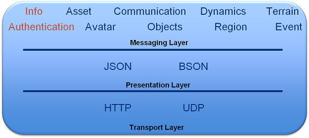

# ARCHITECTURE #

The OpenSim Dispatcher is partitioned into three independent layers: the
transport layer, the presentation layer and the messaging layer.

## Transport Layer

The transport layer facilitates synchronous and asynchronous
communication with OpenSim through HTTP over TCP or UDP connections. It
includes facilities for managing end points for callbacks that simplify,
for example, the implementation of event handlers.

## Presentation Layer

All dispatcher messages [JSON](http://www.json.org/) blobs. The
presentation layer provides two encodings, a standard text-based JSON
encoding and a binary [BSON](http://bsonspec.org/) encoding. Typically,
the text encoding is easier to build and debug. The binary encoding is
often more compact and substantially faster to decode. For applications
controlling real-time behaviors of objects, the binary encoding is a
good choice.

## Messaging Layer

The messaging layer defines a set of messages (and the accompanying
handlers) that enable interaction with an OpenSim scene. The current
implementation provides messages for managing assets, avatars,
communication, object properties including object dynamics (position,
velocity, acceleration), and some events.

Every message contains fields for validating the request. These include
the scene where the message is handled, the message domain (e.g. avatar
messages or object messages), a capability used to verify that
permission has been granted to process the message, and a flag to
indicate whether the message should be processed synchronously or
asynchronously. For example, we could encode a message of type
`"Dispatcher.Message.CreateCapabilityRequest"` into the following JSON
object:

    {
        "$type": "Dispatcher.Messages.CreateCapabilityRequest",
 
        "_AsyncRequest": false, 
        "_Capability": "a1b108dc-11aa-44cb-a971-760dbadef07c", 
        "_Domain": "Dispatcher", 
        "_Scene": "Test Region",
        
        "DomainList": ["Dispatcher", "RemoteControl"], 
        "FirstName": "Test", 
        "LastName": "User", 
        "HashedPasswd": "99cafb4ff0e3a8a6708f3854b713b552", 
        "LifeSpan": 300, 
        "UserID": "16d0f788-2066-4b64-b248-ffa239f62240"
    }

In this message, the "$type" field specifies the type of the
message. The next four fields are contained in every request message and
communicate the way to handle message responses, the capability for
authorizing the action (though for this particular message, the
capability is not required), the domain in which the message will be
interpreted, and the scene to which the message is applied.

The dispatcher module defines three message domains (other domains are
defined in the companion "remote control" package). These are
authentication messages, informational messages, and endpoint
messages. Additional messages are provided in the remote control module.

Detailed information about the messages in each domain can be found here:

* [Dispatcher](messages/dispatcher.md)
* [Remote Control](messages/rcontrol.md)
