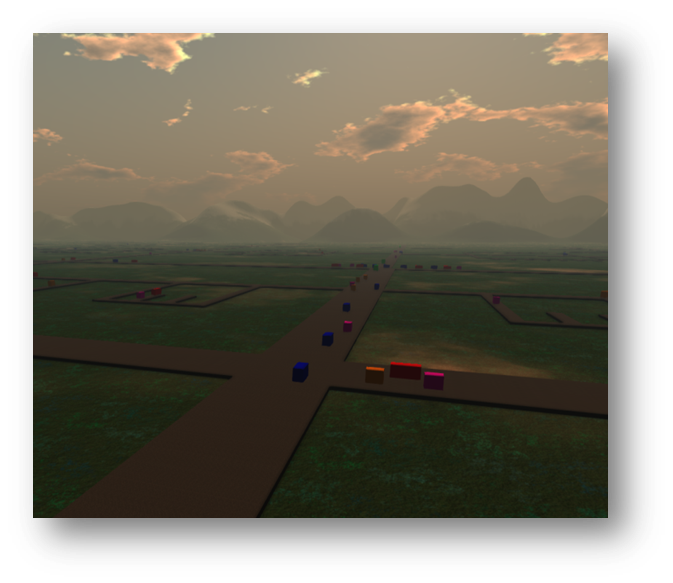

# OVERVIEW #

## INTRODUCTION

The OpenSim Dispatcher defines a message-based, layered interface for
interacting with an OpenSim region through external client
applications. The messages provide an abstract API for an OpenSim scene
including assets and objects, avatars, and events. By specifying the
interaction in terms of messages (specifically JSON/BSON messages) the
API is both language and transport independent. That means that you can
write OpenSim applications in any language that can generate JSON/BSON
messages. Further, concurrent processing of the messages ensures that
high performance application requirements can be met such as those for
real time object dynamics. Finally, all invocations must present a valid
capability that can be generated solely

## ARCHITECTURE

The OpenSim Dispatcher is partitioned into three independent layers: the
transport layer, the presentation layer and the messaging layer.

### Transport Layer

The transport layer facilitates synchronous and asynchronous
communication with OpenSim through HTTP over TCP or UDP connections. It
includes facilities for managing end points for callbacks that simplify,
for example, the implementation of event handlers.

### Presentation Layer

All dispatcher messages [JSON](http://www.json.org/) blobs. The
presentation layer provides two encodings, a standard text-based JSON
encoding and a binary [BSON](http://bsonspec.org/) encoding. Typically,
the text encoding is easier to build and debug. The binary encoding is
often more compact and substantially faster to decode. For applications
controlling real-time behaviors of objects, the binary encoding is a
good choice.

### Messaging Layer

The messaging layer defines a set of messages (and the accompanying
handlers) that enable interaction with an OpenSim scene. The current
implementation provides messages for managing assets, avatars,
communication, object properties including object dynamics (position,
velocity, acceleration), and some events.

Every message contains fields for validating the request. These include
the scene where the message is handled, the message domain (e.g. avatar
messages or object messages), a capability used to verify that
permission has been granted to process the message, and a flag to
indicate whether the message should be processed synchronously or
asynchronously. For example, we could encode a message of type
`"Dispatcher.Message.CreateCapabilityRequest"` into the following JSON
object:

    {
        "$type": "Dispatcher.Messages.CreateCapabilityRequest",
 
        "_AsyncRequest": false, 
        "_Capability": "a1b108dc-11aa-44cb-a971-760dbadef07c", 
        "_Domain": "Dispatcher", 
        "_Scene": "Test Region",
        
        "DomainList": ["Dispatcher", "RemoteControl"], 
        "FirstName": "Test", 
        "LastName": "User", 
        "HashedPasswd": "99cafb4ff0e3a8a6708f3854b713b552", 
        "LifeSpan": 300, 
        "UserID": "16d0f788-2066-4b64-b248-ffa239f62240"
    }

In this message, the "$type" field specifies the type of the
message. The next four fields are contained in every request message and
communicate the way to handle message responses, the capability for
authorizing the action (though for this particular message, the
capability is not required), the domain in which the message will be
interpreted, and the scene to which the message is applied.

The dispatcher module defines three message domains (other domains are
defined in the companion "remote control" package). These are
authentication messages, informational messages, and endpoint
messages. Additional messages are provided in the remote control module.

## SECURITY

The OpenSim Dispatcher interface uses capabilities to ensure that only
authorized messages are acted on. A capability is a UUID that grants for
a limited time the right to send messages from a particular domain
(e.g. the Dispatcher or RemoteControl domains) to a scene.

A capability is created by sending a `"CreateCapabilityRequest"` message
to the dispatcher. That message contains one of three forms of user
identity (a UUID, a name, or an email address), a hashed password, a
list of requested domains, a scene, and a requested lifespan for the
capability. The dispatcher validates the user's identity with the hashed
password and then checks the user's account for the required
privileges. Currently the dispatcher can be configured to limit
capability creation to estate managers or to grid gods (where the access
level to be considered acceptable is configurable). Further, the
dispatcher can be configured to limit the lifespan of capabilities. This
enables the local simulator some control over the risk of replay
attacks.

If the user is authorized to send messages to the scene, the response to
the capability creation request is the UUID for the capability and the
lifespan over which the simulator will consider the capability valid. It
is the client's responsibility to renew the capability periodically with
the `"RenewCapabilityRequest"` message. Best practice suggests that the
client's should send a `"DestroyCapabilityRequest"` when they are
finished with the capability.

Every message sent to the dispatcher must contain a valid capability in
the `"_Capability"` field.  If the capability is no longer valid or does
not authorize the client to send a particular message, then the message
is immediately dropped and a "Not authorized" response is sent to the
client.

## USAGE
